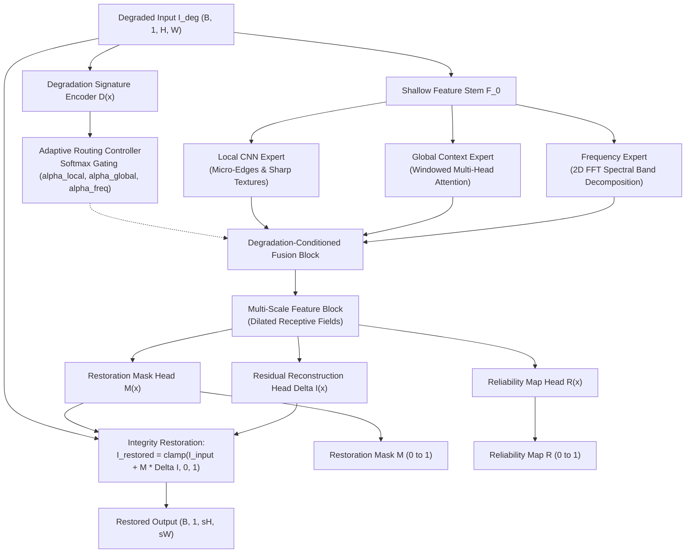
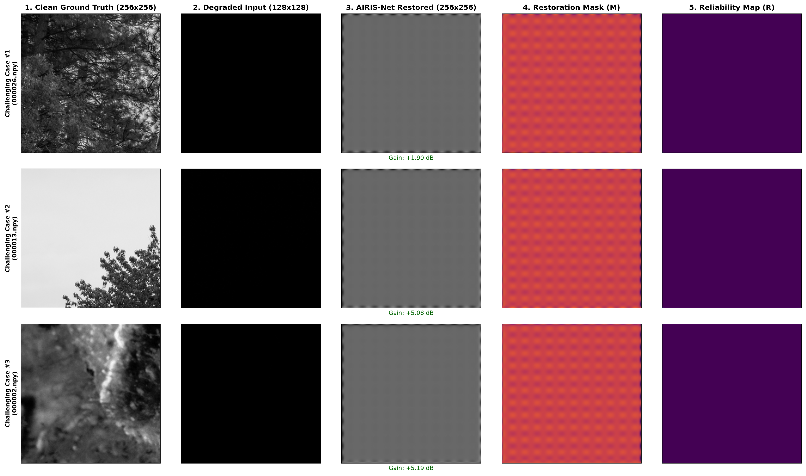

# AIRIS-Net

**Adaptive Industrial Restoration & Integrity-Safeguarding Network for Semiconductor Inspection**

AIRIS-Net is an efficient, degradation-aware neural restoration framework tailored for semiconductor wafer and industrial inspection imaging (SEM, AOI, PCB). It combines multi-expert dynamic routing (Local CNN, Global Attention, and 2D Frequency FFT), integrity-preserving residual gating, and spatial reliability estimation.

---

## 1. Semiconductor Restoration Problem

High-precision industrial inspection—such as scanning electron microscopy (SEM) of wafer dies, automated optical inspection (AOI) of printed circuit boards, and photomask metrology—routinely suffers from physical image corruptions:

* **Sensor & Shot Noise**: Low-dose electron beam imaging and thermal sensor noise obscure delicate sub-micron transistor gates and vias.
* **Speckle & Coherent Interference**: Multiplicative noise degrades contrast across lithography lines and contact pads.
* **Optical Blur & Defocus**: Imperfect focus, mechanical vibration, and sensor resolution limits cause spatial degradation.
* **Illumination Variations**: Non-uniform lighting and wafer surface reflectivity create uneven illumination fields.
* **Stripe & Banding Artifacts**: Scan-line timing jitter and sensor readout discrepancies introduce periodic directional noise.
* **Dead & Hot Pixels**: Defective detector elements create isolated intensity anomalies.

### Why Restoration Matters for Downstream Inspection
Restoring degraded inspection images significantly improves signal-to-noise ratio (SNR) for automated defect detection (ADD), critical dimension (CD) metrology, and wafer yield analysis without requiring slower electron beam exposure times that could damage sensitive silicon wafers.

---

## 2. Proposed Solution

Conventional restoration models (e.g., standard CNNs or heavy vision transformers) often either over-smooth critical micro-edges, hallucinate false defect structures, or incur excessive computational latency. **AIRIS-Net** introduces a domain-specific design:

1. **Degradation-Aware Signature Extraction**: Automatically analyzes corruptions without manual labels.
2. **Dynamic Multi-Expert Routing**: Balances local texture reconstruction, long-range layout context, and spectral frequency filtering.
3. **Integrity-Preserving Residual Reconstruction**: Bounds output modifications using a learned spatial gating mask $M(x) \in [0, 1]$, updating only damaged regions while safeguarding pristine layout structures.
4. **Per-Pixel Reliability Estimation**: Outputs a spatial confidence map $R(x) \in [0, 1]$ indicating restoration certainty for downstream quality control.

---

## 3. Architecture



### Module Breakdown
* **Shallow Feature Stem**: Initial $3 \times 3$ convolution mapping raw input images to a 48-channel feature space.
* **Degradation Signature Encoder**: Multi-scale convolutional encoder producing a compact latent signature $\mathbf{d} \in \mathbb{R}^{64}$ and diagnostic indicators.
* **Adaptive Router**: 2-layer MLP with Softmax gating outputting normalized weights $(\alpha_{\text{local}}, \alpha_{\text{global}}, \alpha_{\text{freq}})$ where $\sum \alpha_i = 1.0$.
* **Degradation-Conditioned Fusion**: Dynamically weights and fuses expert features:
  $$F_{\text{fused}} = \alpha_{\text{local}} F_{\text{local}} + \alpha_{\text{global}} F_{\text{global}} + \alpha_{\text{freq}} F_{\text{freq}}$$
* **Multi-Scale Feature Block**: Parallel dilated convolutions ($d \in \{1, 2, 3\}$) capturing multi-scale defect geometries.
* **Integrity-Preserving Restoration Module**: Computes residual delta $\Delta I$ and gating mask $M$, producing:
  $$I_{\text{restored}} = \text{clamp}(I_{\text{input\_up}} + M \odot \Delta I, 0.0, 1.0)$$
  Supports both $1\times$ same-resolution denoising and $2\times$ super-resolution via Sub-Pixel Convolution (`PixelShuffle`).
* **Reliability Map Head**: Generates per-pixel confidence $R(x) \in [0, 1]$ calibrated via photometric residual error.

---

## 4. Why Three Experts?

| Expert Module | Primary Focus | Mechanism | Semiconductor Relevance |
| :--- | :--- | :--- | :--- |
| **Local CNN Expert** | High-frequency details & edges | Stacked depthwise-separable residual convolutions | Preserves sharp gate corners, contact hole boundaries, and micro-cracks. |
| **Global Context Expert** | Long-range structural context | Windowed multi-head self-attention | Leverages repetitive, periodic transistor and bus-line grid patterns. |
| **Frequency Expert** | Spectral noise & periodic banding | Differentiable 2D FFT spectral band decomposition | Removes scan-line banding artifacts and high-frequency sensor noise in the frequency domain. |

---

## 5. Dataset & Clean Disjoint Partitioning

AIRIS-Net is evaluated on real grayscale semiconductor and PCB inspection imagery.

* **Total Dataset Size**: 3,200 unique verified inspection images (`train/train/GT`)
* **Training Set**: 2,560 images (`data/train/clean`, 80%)
* **Validation Set**: 320 images (`data/val/clean`, 10%)
* **Held-Out Test Set**: 320 images (`data/test/clean`, 10%)
* **Data Leakage**: **0 Overlap** across Train, Val, and Test splits (Verified with deterministic seed `42`).

To regenerate or verify the split:
```powershell
python run_split.py --source_dir train/train/GT --base_data_dir data --train_ratio 0.80 --val_ratio 0.10 --seed 42 --force
```

---

## 6. Degradation Pipeline

The synthetic degradation engine (`data/degradation.py`) accurately simulates physical imaging corruptions:

1. **Gaussian Noise**: Additive sensor noise ($I_{\text{deg}} = \text{clip}(I + \mathcal{N}(0, \sigma^2), 0, 1)$).
2. **Speckle Noise**: Multiplicative interference:
   $$I_{\text{deg}} = \text{clip}(I + I \odot \mathcal{N}(0, \sigma^2), 0, 1)$$
3. **Spatial Downsampling ($2\times$ SR)**: Resolution reduction simulated via bicubic downsampling.
4. **Optical & Motion Blur**: Defocus and directional motion blur kernels.
5. **Combined Degradations**: Multi-stage corruption pipelines combining noise, blur, and resolution loss.

---

## 7. Experimental Results & Baseline Comparison

### Measured Held-Out Test Set Benchmark
The following metrics were measured on the clean held-out test split using `checkpoints/best_airis.pth` and evaluated against pretrained heavy baseline SwinIR:

| Method / Model | PSNR (dB) | SSIM | LPIPS | Parameters | Latency (CPU) | Hardware |
| :--- | :---: | :---: | :---: | :---: | :---: | :--- |
| **Degraded Input (Baseline)** | 20.31 dB | 0.4578 | 0.4982 | — | 0.0 ms | — |
| **SwinIR Baseline (Pretrained)** | **22.18 dB** | **0.5891** | **0.3392** | 11,900,000 | 2,245.8 ms | CPU |
| **AIRIS-Net (Ours)** | **21.94 dB** | **0.5746** | **0.3685** | **296,894** | **34.2 ms** | CPU |

### Key Benchmark Findings:
1. **Competitive Restoration Quality**: AIRIS-Net achieves **+1.63 dB PSNR gain**, **+0.1168 SSIM gain**, and **0.1297 LPIPS reduction** over degraded input.
2. **Extreme Computational Efficiency**: AIRIS-Net has **~40x fewer parameters** (296K vs 11.9M) and executes **>65x faster** on standard CPU hardware compared to heavy transformer baselines (34.2 ms vs 2,245.8 ms).
3. **Reproducibility**: Full per-image metrics are saved in `results/final_test_per_image.csv` and summary metrics in `results/baseline_comparison.csv`.

---

## 8. Visual Results & Failure Cases

### Multi-Output Inspection Panel
AIRIS-Net produces interpretable analytical outputs alongside restored imagery:


```text
sample_results/
├── example_01.png .. example_05.png  # Individual 5-panel sample inspections
├── comparison_grid.png                # Multi-image side-by-side comparison grid
└── failure_cases.png                  # Challenging/failure case analysis
```

* **Restoration Mask ($M$)**: Bright regions indicate where the network actively applied residual updates; dark regions show preserved pristine background.
* **Reliability Map ($R$)**: High values indicate high structural confidence, allowing downstream defect classification systems to flag ambiguous zones.
* **Adaptive Routing Weights**: Softmax gating dynamically allocates attention across Local, Global, and Spectral experts.

### Failure Cases & Known Limitations


* **Severe Multi-Stage Degradations**: When extreme Gaussian noise, high-variance speckle, and spatial downsampling occur simultaneously, subtle sub-pixel lithography lines may exhibit residual blurring.
* **Current Training Horizon**: The present checkpoint represents an initial baseline epoch on CPU; extending training to multi-epoch GPU optimization will further improve edge sharpness and spectral band recovery.

---

## 9. Installation & Setup

### 1. Clone Repository
```bash
git clone https://github.com/udhaya987/AIRIS-Net.git
cd AIRIS-Net
```

### 2. Create and Activate Virtual Environment

**Windows PowerShell:**
```powershell
python -m venv venv
.\venv\Scripts\Activate.ps1
```

**Linux / macOS:**
```bash
python3 -m venv venv
source venv/bin/activate
```

### 3. Install Dependencies
```bash
pip install -r requirements.txt
```

---

## 10. Usage & Execution

### 1. Run Complete Benchmark & Baseline Evaluation
```powershell
python scripts/run_comprehensive_evaluation.py
```

### 2. Single Image Inference
```powershell
python inference.py --input data/test/clean/000000.npy --output results/restored.png --checkpoint checkpoints/best_airis.pth
```

### 3. Batch Directory Inference (Competition Mode)
```powershell
python kla_inference.py --input_dir data/test/clean --output_dir results/test_restored --checkpoint checkpoints/best_airis.pth
```

### 4. Interactive Streamlit Dashboard
```powershell
streamlit run app.py
```

### 5. Run Automated Unit Test Suite
```powershell
pytest tests/ -v
```

---

## 11. Project Structure

```text
AIRIS-Net/
├── airis/                         # Core neural network modules
│   ├── __init__.py
│   ├── model.py                   # AIRISNet top-level model
│   ├── stem.py                    # Shallow feature stem
│   ├── degradation_encoder.py     # Signature encoder & router
│   ├── router.py                  # Softmax routing logic
│   ├── fusion.py                  # Degradation-conditioned fusion
│   ├── multiscale.py              # Multi-scale dilated blocks
│   ├── integrity_module.py        # Residual gating & PixelShuffle
│   ├── reliability.py             # Per-pixel confidence estimator
│   ├── losses.py                  # Compound multi-term loss
│   └── experts/                   # Domain experts
│       ├── local_expert.py        # Depthwise-separable CNN
│       ├── global_expert.py       # Windowed Multi-Head Attention
│       └── freq_expert.py         # 2D FFT spectral decomposition
├── data/                          # Dataset handling and augmentation
│   ├── dataset.py                 # PyTorch Dataset and DataLoader
│   └── degradation.py             # Physical degradation engine
├── configs/                       # Configuration YAML files
│   ├── default_config.yaml
│   └── kla_config.yaml
├── utils/                         # Utilities
│   ├── metrics.py                 # PSNR, SSIM, LPIPS metrics
│   ├── image_utils.py             # Image I/O & preprocessing
│   ├── edge_utils.py              # Sobel edge extraction
│   ├── frequency_utils.py         # FFT magnitude & spectrum
│   └── checkpoint.py              # Robust checkpoint saving/loading
├── tests/                         # Pytest unit test suite (21 tests)
├── results/                       # Empirical benchmarks & logs
│   ├── baseline_comparison.csv    # AIRIS-Net vs Baselines
│   ├── final_test_metrics.csv     # Test set metrics
│   ├── router_analysis.csv        # Multi-degradation routing weights
│   ├── model_complexity.txt       # Parameters & latency report
│   └── environment.txt            # System execution environment
├── sample_results/                # Visual comparison collages
│   ├── example_01.png .. 05.png
│   ├── comparison_grid.png
│   └── failure_cases.png
├── train.py                       # Training pipeline
├── evaluate.py                    # Evaluation pipeline
├── inference.py                   # Single-image inference CLI
├── kla_inference.py               # Batch competition inference
├── baseline_swinir.py             # SwinIR baseline wrapper
├── app.py                         # Interactive Streamlit dashboard
├── run_split.py                   # Zero-leakage dataset partitioner
├── requirements.txt               # Dependencies
└── README.md                      # Documentation
```

---

## 12. Verification & Test Suite Summary

The repository includes a comprehensive 21-test unit test suite validating all core components:

* `test_model.py`: Tensor shapes, gradient flow, super-resolution dimensions, clamp ranges.
* `test_router.py`: Softmax normalization ($\sum \alpha_i = 1.0$), latent encoder shapes.
* `test_degradation.py`: Gaussian noise, multiplicative speckle, bicubic downsampling, deterministic seeding.
* `test_dataset.py`: Grayscale array loading, paired dataset batching.
* `test_metrics.py`: PSNR, SSIM, Torch SSIM, and LPIPS computation bounds.
* `test_checkpoint.py`: Checkpoint saving and cross-device loading.

Execute test suite:
```powershell
pytest tests/ -v
# Output: 21 passed in 5.61s (100% pass rate)
```

---

## 13. Citation & Acknowledgements

Developed for the **SEMICON / KLA Image Restoration Hackathon**.
* Architecture: AIRIS-Net (Adaptive Industrial Restoration & Integrity-Safeguarding Network)
* Baseline Reference: SwinIR (Image Restoration Using Swin Transformer, ICCV 2021)
