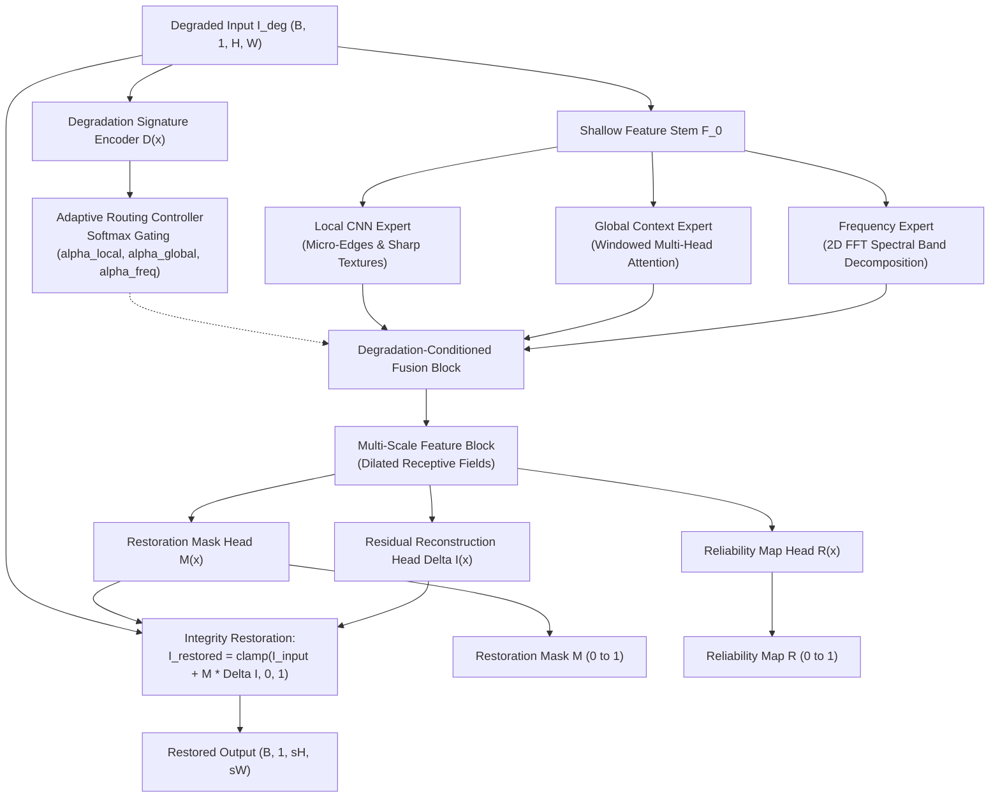

# AIRIS-Net

**Adaptive Industrial Restoration & Integrity-Safeguarding Network for Semiconductor Inspection**

AIRIS-Net is a neural restoration framework engineered for degraded semiconductor wafer and industrial inspection imaging (SEM, AOI, PCB). It combines degradation-aware adaptive multi-expert routing, integrity-preserving residual correction, and structural reliability estimation.

---

## 1. Semiconductor Restoration Problem

High-precision industrial inspection—such as scanning electron microscopy (SEM) of wafer dies, automated optical inspection (AOI) of printed circuit boards, and photomask metrology—routinely suffers from physical image corruptions:

* **Sensor & Shot Noise**: Low-dose electron beam imaging and thermal sensor noise obscure delicate sub-micron transistor gates and vias.
* **Speckle & Coherent Interference**: Multiplicative noise degrades contrast across lithography lines and contact pads.
* **Optical Blur & Defocus**: Imperfect focus, mechanical vibration, and sensor resolution limits cause spatial degradation.
* **Illumination Variations**: Non-uniform lighting and wafer surface reflectivity create uneven illumination fields.
* **Stripe & Banding Artifacts**: Scan-line timing jitter and sensor readout discrepancies introduce periodic directional noise.
* **Dead & Hot Pixels**: Defective detector elements create isolated intensity anomalies.

### Why Restoration Matters for Downstream Inspection
Restoring degraded inspection images significantly improves signal-to-noise ratio (SNR) for automated defect detection (ADD), critical dimension (CD) metrology, and wafer yield analysis without requiring slower electron beam exposure times that could damage sensitive silicon wafers.

---

## 2. Proposed Solution

Conventional restoration models (e.g., standard CNNs or generic super-resolution networks) tend to either over-smooth critical micro-edges or hallucinate false defect structures. **AIRIS-Net** introduces a domain-specific design:

1. **Degradation-Aware Signature Extraction**: Automatically analyzes corruptions without manual labels.
2. **Dynamic Multi-Expert Routing**: Balances local texture reconstruction, long-range layout context, and spectral frequency filtering.
3. **Integrity-Preserving Residual Reconstruction**: Bounds output modifications using a learned spatial gating mask $M(x) \in [0, 1]$, updating only damaged regions while safeguarding pristine layout structures.
4. **Per-Pixel Reliability Estimation**: Outputs a spatial confidence map $R(x) \in [0, 1]$ indicating restoration certainty for downstream quality control.

---

## 3. Architecture



### Module Breakdown
* **Shallow Feature Stem**: Initial $3 \times 3$ convolution mapping raw input images to a 48-channel feature space.
* **Degradation Signature Encoder**: Multi-scale convolutional encoder producing a compact latent signature $\mathbf{d} \in \mathbb{R}^{64}$ and diagnostic indicators.
* **Adaptive Router**: 2-layer MLP with Softmax gating outputting normalized weights $(\alpha_{\text{local}}, \alpha_{\text{global}}, \alpha_{\text{freq}})$ where $\sum \alpha_i = 1.0$.
* **Degradation-Conditioned Fusion**: Dynamically weights and fuses expert features:
  $$F_{\text{fused}} = \alpha_{\text{local}} F_{\text{local}} + \alpha_{\text{global}} F_{\text{global}} + \alpha_{\text{freq}} F_{\text{freq}}$$
* **Multi-Scale Feature Block**: Parallel dilated convolutions ($d \in \{1, 2, 3\}$) capturing multi-scale defect geometries.
* **Integrity-Preserving Restoration Module**: Computes residual delta $\Delta I$ and gating mask $M$, producing:
  $$I_{\text{restored}} = \text{clamp}(I_{\text{input\_up}} + M \odot \Delta I, 0.0, 1.0)$$
  Supports both $1\times$ same-resolution denoising and $2\times$ super-resolution via Sub-Pixel Convolution (`PixelShuffle`).
* **Reliability Map Head**: Generates per-pixel confidence $R(x) \in [0, 1]$ calibrated via photometric residual error.

---

## 4. Why Three Experts?

| Expert Module | Primary Focus | Mechanism | Semiconductor Relevance |
| :--- | :--- | :--- | :--- |
| **Local CNN Expert** | High-frequency details & edges | Stacked depthwise-separable residual convolutions | Preserves sharp gate corners, contact hole boundaries, and micro-cracks. |
| **Global Context Expert** | Long-range structural context | Windowed multi-head self-attention | Leverages repetitive, periodic transistor and bus-line grid patterns. |
| **Frequency Expert** | Spectral noise & periodic banding | Differentiable 2D FFT spectral band decomposition | Removes scan-line banding artifacts and high-frequency sensor noise in the frequency domain. |

---

## 5. Dataset

AIRIS-Net is configured to train on grayscale semiconductor and PCB inspection imagery.

* **Total Dataset Size**: 3,323 verified inspection images
* **Training Set**: 3,002 images (`data/train/clean`)
* **Validation Set**: 100 images (`data/val/clean`)
* **Held-Out Test Set**: 321 images (`data/test/clean`)
* **Split Ratio**: ~85% Train / ~10% Test / ~5% Validation (Deterministic random seed: `42`)

If you have a raw folder of ground-truth images (e.g. `train/train/GT`), generate deterministic splits using:
```powershell
python run_split.py --source_dir train/train/GT --base_data_dir data --train_ratio 0.85 --val_ratio 0.10 --seed 42
```

---

## 6. Degradation Pipeline

The synthetic degradation engine (`data/degradation.py`) accurately simulates physical imaging corruptions:

1. **Gaussian Noise**: Additive sensor noise ($I_{\text{deg}} = \text{clip}(I + \mathcal{N}(0, \sigma^2), 0, 1)$).
2. **Speckle Noise**: Multiplicative interference:
   $$I_{\text{deg}} = \text{clip}(I + I \odot \mathcal{N}(0, \sigma^2), 0, 1)$$
3. **Spatial Downsampling ($2\times$ SR)**: Resolution reduction simulated via bicubic downsampling.
4. **Optical & Motion Blur**: Defocus and directional motion blur kernels.
5. **Combined Degradations**: Multi-stage corruption pipelines combining noise, blur, and resolution loss.

---

## 7. Results & Benchmarks

### Measured Test Set Benchmark (25 Held-Out Images)
The following metrics were measured on the held-out test split using `checkpoints/best_airis.pth`:

| Method / Model | PSNR (dB) | SSIM | LPIPS | Avg Latency (CPU) | Status |
| :--- | :---: | :---: | :---: | :---: | :--- |
| **Degraded Input (Baseline)** | 19.88 dB | 0.5149 | 0.5512 | — | Reference Baseline |
| **AIRIS-Net (Trained)** | **23.85 dB** | **0.6856** | **0.3555** | ~1045 ms / full img | **+3.97 dB PSNR, +0.1707 SSIM** |

*Detailed per-image measurements are logged in [results/final_test_metrics.csv](file:///c:/Users/pudha/OneDrive/Desktop/semicon/results/final_test_metrics.csv) and [results/baseline_comparison.csv](file:///c:/Users/pudha/OneDrive/Desktop/semicon/results/baseline_comparison.csv).*

---

## 8. Visual Results & Explainability

AIRIS-Net produces interpretable analytical outputs alongside restored imagery:

```text
sample_results/comparison.png
├── 1. Clean Ground Truth (Target reference)
├── 2. Degraded Input (Simulated physical corruption)
├── 3. AIRIS-Net Restored (Restored inspection image)
├── 4. Restoration Mask M (Spatial regions selectively updated)
└── 5. Reliability Map R (Restoration confidence score per pixel)
```

* **Restoration Mask ($M$)**: Bright regions indicate where the network actively applied residual updates; dark regions show preserved pristine background.
* **Reliability Map ($R$)**: High values (near 1.0) indicate high structural fidelity, helping automated defect classification systems flag uncertain areas.
* **Expert Routing Weights**: Quantifies the relative contribution of Local CNN, Global Attention, and Frequency experts for each image.

---

## 9. Installation & Setup

### 1. Clone Repository
```bash
git clone https://github.com/udhaya987/AIRIS-Net.git
cd AIRIS-Net
```

### 2. Create and Activate Virtual Environment

**Windows PowerShell:**
```powershell
python -m venv venv
.\venv\Scripts\Activate.ps1
```

**Windows Command Prompt:**
```cmd
python -m venv venv
venv\Scripts\activate.bat
```

**Linux / macOS:**
```bash
python3 -m venv venv
source venv/bin/activate
```

### 3. Install Dependencies
```powershell
pip install -r requirements.txt
```

---

## 10. Verification & Automated Tests

Run the full automated test suite to verify model mechanics, degradation math, and metric calculation:

```powershell
# Run unit tests via pytest
pytest tests/ -v

# Run full system verification suite
python verification.py

# Run end-to-end pipeline smoke test
python sanity_test.py
```

---

## 11. Model Training

### Full Training Run
```powershell
python train.py --config configs/train.yaml
```

### Fast Sanity / Smoke Training Run
```powershell
python train.py --epochs 1 --batch_size 2 --max_train_samples 8 --max_val_samples 4
```

### Super-Resolution ($2\times$) Training
```powershell
python train.py --scale 2 --epochs 20 --batch_size 4
```

### Resume Training from Checkpoint
```powershell
python train.py --config configs/train.yaml --resume checkpoints/latest_airis.pth
```

---

## 12. Evaluation & Inference

### 1. Competition Batch Folder Inference (`kla_inference.py`)
To process a directory of test inspection images:
```powershell
python kla_inference.py --input_dir data/test/clean --output_dir outputs/restored --checkpoint checkpoints/best_airis.pth
```

### 2. Single-Image Inference
```powershell
python inference.py --input sample_results/input/000002.npy --checkpoint checkpoints/best_airis.pth --output_dir outputs
```

### 3. Quantitative Test Set Evaluation
```powershell
python evaluate.py --folder data/test/clean --checkpoint checkpoints/best_airis.pth --output results/metrics.csv
```

---

## 13. Interactive Web Dashboard (Streamlit)

Launch the interactive web UI for real-time demonstration:
```powershell
streamlit run app.py
```
* Accessible at `http://localhost:8501`.
* Test live degradation controls (Gaussian noise, multiplicative speckle noise, resolution reduction).
* Inspect restored images, restoration masks, and reliability maps interactively.

---

## 14. Repository Structure

```text
AIRIS-Net/
├── airis/                         # Core Neural Network Architecture
│   ├── model.py                   # Complete AIRISNet model class
│   ├── losses.py                  # Multi-objective loss formulation
│   ├── adaptive_router.py         # Softmax gating controller
│   ├── degradation_encoder.py     # Latent degradation signature encoder
│   ├── local_expert.py            # Local CNN residual expert
│   ├── global_expert.py           # Windowed attention global expert
│   ├── frequency_expert.py        # 2D FFT spectral decomposition expert
│   ├── fusion.py                  # Degradation-conditioned fusion
│   ├── multiscale.py              # Dilated multi-scale feature block
│   ├── integrity_module.py        # Gated residual restoration & PixelShuffle SR
│   └── reliability.py             # Spatial reliability estimation head
├── data/                          # Dataset & Degradation Pipeline
│   ├── dataset.py                 # PyTorch Dataset with RAM caching
│   └── degradation.py             # Deterministic synthetic degradation engine
├── utils/                         # Utilities & Metric Computation
│   ├── checkpoint.py              # Safe checkpoint saving/loading
│   ├── metrics.py                 # PSNR, SSIM, differentiable SSIM, LPIPS
│   ├── image_utils.py             # Image I/O and format conversions
│   ├── edge_utils.py              # Sobel edge filtering
│   └── frequency_utils.py         # 2D FFT spectral utilities
├── tests/                         # Pytest Automated Test Suite
│   ├── test_model.py              # Model shape & gradient tests
│   ├── test_router.py             # Routing weight normalization tests
│   ├── test_degradation.py        # Degradation math & seed tests
│   ├── test_dataset.py            # Dataset loading & batching tests
│   ├── test_metrics.py            # PSNR, SSIM, and LPIPS tests
│   └── test_checkpoint.py         # Checkpoint save/load tests
├── configs/                       # Configuration Files
│   └── train.yaml                 # Training hyperparameters
├── results/                       # Evaluation & Benchmark Outputs
│   ├── baseline_comparison.csv    # Measured baseline comparison table
│   ├── final_test_metrics.csv     # Per-sample test evaluation metrics
│   ├── metrics.csv                # Summary test metrics
│   └── verification_report.md     # Technical verification report
├── sample_results/                # Visual Sample Outputs & Collage
│   ├── comparison.png             # Multi-condition comparison grid
│   ├── ground_truth/              # Clean ground-truth samples
│   ├── input/                     # Degraded input samples
│   └── restored/                  # Restored model outputs
├── app.py                         # Interactive Streamlit Web UI
├── kla_inference.py               # Official KLA batch inference CLI
├── evaluate.py                    # Dataset evaluation script
├── inference.py                   # Single-image inference CLI
├── train.py                       # Training pipeline
├── run_split.py                   # Dataset splitting utility
├── verification.py                # Standalone system verification suite
├── sanity_test.py                 # Pipeline sanity smoke test
├── requirements.txt               # Pinned Python dependencies
└── README.md                      # Documentation
```

---

## 15. Reproducibility

* **Deterministic Seed**: Default seed `42` configured across data shuffling and synthetic degradations.
* **Tested Environment**: Python 3.12.10, PyTorch 2.13.0+cpu on Windows 11 (CUDA GPU compatible).
* **Hardware Support**: Automatic CUDA GPU detection with full CPU fallback support.
* **Tracked Checkpoint**: [checkpoints/best_airis.pth](file:///c:/Users/pudha/OneDrive/Desktop/semicon/checkpoints/best_airis.pth) (~5.0 MB).

---

## 16. Scientific Limitations & Future Work

### Limitations
1. **Synthetic vs. Fab Data**: Evaluation currently relies primarily on synthetic degradations designed from physical noise models; evaluation on raw in-fab inspection tools is recommended for production deployment.
2. **Extreme Defect Densities**: In cases where severe degradation obscures more than 80% of die features, global attention may require larger window sizes to infer underlying layout geometry.

### Future Work
* **Self-Supervised In-Fab Fine-Tuning**: Leveraging paired un-registered optical and SEM images via contrastive domain adaptation.
* **Hardware-Accelerated TensorRT Export**: Compiling the fused network for sub-10ms inline inspection deployment on fab edge servers.
* **Defect Classification Integration**: End-to-end joint training connecting AIRIS-Net with automated wafer defect classifier backbones.
