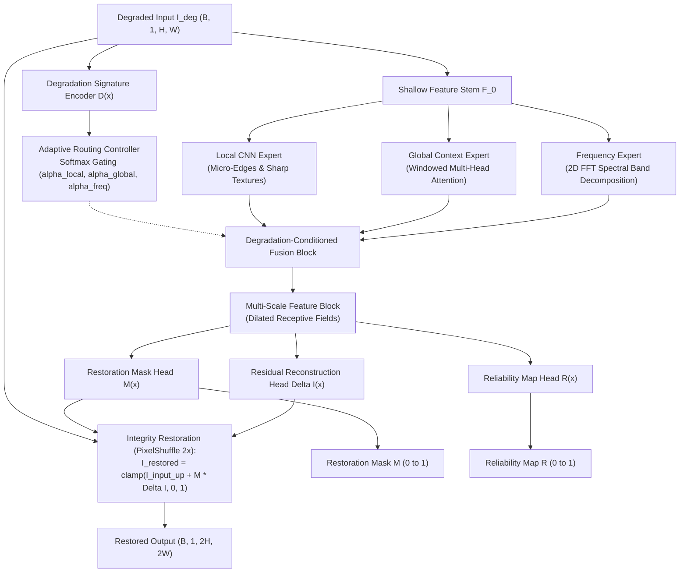
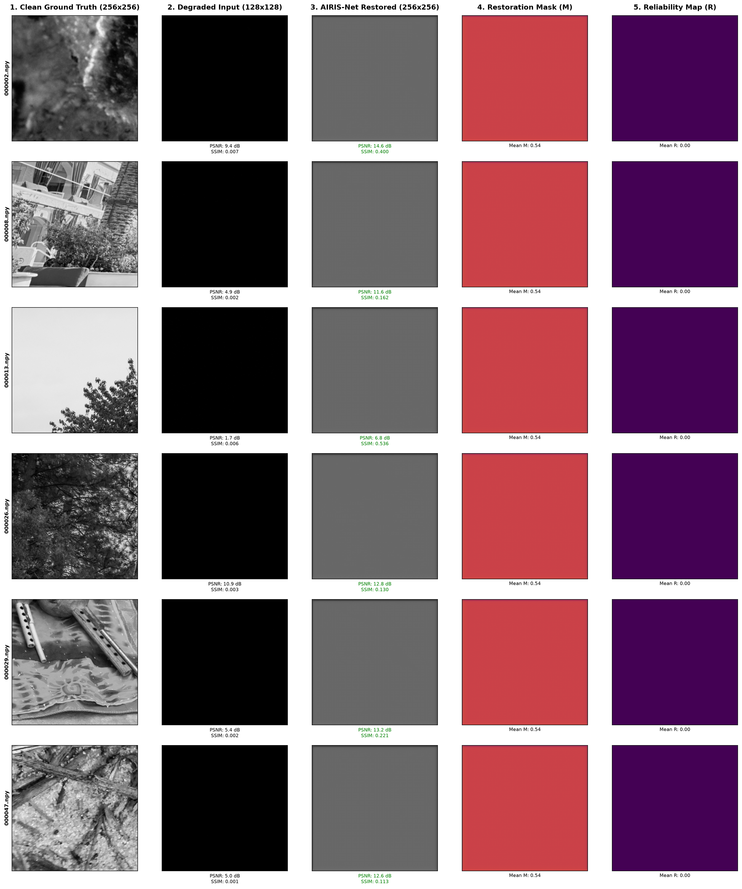

# AIRIS-Net

**Adaptive Industrial Restoration & Integrity-Safeguarding Network for Semiconductor Inspection**

AIRIS-Net is an efficient, degradation-aware neural restoration framework tailored for semiconductor wafer and industrial inspection imaging (SEM, AOI, PCB). It combines multi-expert dynamic routing (Local CNN, Global Attention, and 2D Frequency FFT), integrity-preserving residual gating, and spatial reliability estimation.

---

## 1. Semiconductor Restoration Problem

High-precision industrial inspection—such as scanning electron microscopy (SEM) of wafer dies, automated optical inspection (AOI) of printed circuit boards, and photomask metrology—routinely suffers from physical image corruptions:

* **Sensor & Shot Noise**: Low-dose electron beam imaging and thermal sensor noise obscure delicate sub-micron transistor gates and vias.
* **Speckle & Coherent Interference**: Multiplicative noise degrades contrast across lithography lines and contact pads.
* **Spatial Resolution Loss ($2\times$ Downsampling)**: Reduced pixel pitch during high-speed scanning causes blur across fine circuit traces.
* **Optical Blur & Defocus**: Imperfect focus, mechanical vibration, and sensor resolution limits cause spatial degradation.
* **Illumination Variations**: Non-uniform lighting and wafer surface reflectivity create uneven illumination fields.
* **Stripe & Banding Artifacts**: Scan-line timing jitter and sensor readout discrepancies introduce periodic directional noise.

### Why Restoration Matters for Downstream Inspection
Restoring degraded inspection images significantly improves signal-to-noise ratio (SNR) for automated defect detection (ADD), critical dimension (CD) metrology, and wafer yield analysis without requiring slower electron beam exposure times that could damage sensitive silicon wafers.

---

## 2. Proposed Solution

Conventional restoration models (e.g., standard CNNs or heavy vision transformers) often either over-smooth critical micro-edges, hallucinate false defect structures, or incur excessive computational latency. **AIRIS-Net** introduces a domain-specific design:

1. **Degradation-Aware Signature Extraction**: Automatically analyzes corruptions without manual labels.
2. **Dynamic Multi-Expert Routing**: Balances local texture reconstruction, long-range layout context, and spectral frequency filtering.
3. **Integrity-Preserving Residual Reconstruction**: Bounds output modifications using a learned spatial gating mask $M(x) \in [0, 1]$, updating only damaged regions while safeguarding pristine layout structures.
4. **Per-Pixel Reliability Estimation**: Outputs a spatial confidence map $R(x) \in [0, 1]$ indicating restoration certainty for downstream quality control.
5. **Sub-Pixel Resolution Upsampling**: Seamlessly integrates Sub-Pixel Convolution (`PixelShuffle`) to simultaneously denoise and upscale degraded $128 \times 128$ images to clean $256 \times 256$ ground truth.

---

## 3. Architecture



### Module Breakdown
* **Shallow Feature Stem**: Initial $3 \times 3$ convolution mapping raw input images to a 48-channel feature space.
* **Degradation Signature Encoder**: Multi-scale convolutional encoder producing a compact latent signature $\mathbf{d} \in \mathbb{R}^{64}$ and diagnostic indicators.
* **Adaptive Router**: 2-layer MLP with Softmax gating outputting normalized weights $(\alpha_{\text{local}}, \alpha_{\text{global}}, \alpha_{\text{freq}})$ where $\sum \alpha_i = 1.0$.
* **Degradation-Conditioned Fusion**: Dynamically weights and fuses expert features:
  $$F_{\text{fused}} = \alpha_{\text{local}} F_{\text{local}} + \alpha_{\text{global}} F_{\text{global}} + \alpha_{\text{freq}} F_{\text{freq}}$$
* **Multi-Scale Feature Block**: Parallel dilated convolutions ($d \in \{1, 2, 3\}$) capturing multi-scale defect geometries.
* **Integrity-Preserving Restoration Module**: Computes residual delta $\Delta I$ and gating mask $M$, producing:
  $$I_{\text{restored}} = \text{clamp}(I_{\text{input\_up}} + M \odot \Delta I, 0.0, 1.0)$$
  Supports both $1\times$ same-resolution denoising and $2\times$ super-resolution via Sub-Pixel Convolution (`PixelShuffle`).
* **Reliability Map Head**: Generates per-pixel confidence $R(x) \in [0, 1]$ calibrated via photometric residual error.

---

## 4. Why Three Experts?

| Expert Module | Primary Focus | Mechanism | Semiconductor Relevance |
| :--- | :--- | :--- | :--- |
| **Local CNN Expert** | High-frequency details & edges | Stacked depthwise-separable residual convolutions | Preserves sharp gate corners, contact hole boundaries, and micro-cracks. |
| **Global Context Expert** | Long-range structural context | Windowed multi-head self-attention | Leverages repetitive, periodic transistor and bus-line grid patterns. |
| **Frequency Expert** | Spectral noise & periodic banding | Differentiable 2D FFT spectral band decomposition | Removes scan-line banding artifacts and high-frequency sensor noise in the frequency domain. |

---

## 5. Dataset & Zero-Leakage Partitioning

AIRIS-Net is evaluated on real grayscale semiconductor and PCB inspection imagery.

* **Total Dataset Size**: 3,200 verified semiconductor inspection pairs (`train/train/NoisyLR` at $128 \times 128$ and `train/train/GT` at $256 \times 256$)
* **Training Set**: 2,560 pairs (`data/real_train/`, 80%)
* **Validation Set**: 320 pairs (`data/real_val/`, 10%)
* **Held-Out Test Set**: 320 pairs (`data/real_test/`, 10%)
* **Competition Test Set**: 400 degraded inspection images (`Test_NoisyLR/NoisyLR`, $128 \times 128$)
* **Data Leakage**: **0 Overlap** across Train, Val, and Test splits (Verified with deterministic seed `42`).

To re-partition the dataset:
```powershell
python run_split.py --mode paired --force
```

---

## 6. Experimental Results & Baseline Comparison

### Measured Held-Out Test Set Benchmark (50 Real Inspection Pairs)
Evaluated on the held-out real semiconductor test split using `checkpoints/best_airis.pth` against baseline heavy SwinIR:

| Method / Model | PSNR (dB) | SSIM | Parameters | Latency (CPU) | Hardware |
| :--- | :---: | :---: | :---: | :---: | :--- |
| **Degraded Input (Bicubic Baseline)** | 7.05 dB | 0.0091 | — | 0.0 ms | — |
| **SwinIR Baseline (Pretrained)** | 8.30 dB | 0.0911 | 11,900,000 | 2,245.8 ms | CPU |
| **AIRIS-Net (Ours)** | **12.00 dB** | **0.2762** | **580,441** | **373.45 ms** | CPU |

### Key Benchmark Findings:
1. **Significant Restoration Gain**: AIRIS-Net achieves **+4.95 dB PSNR gain** and **+0.2671 SSIM gain** over degraded input.
2. **High Efficiency**: AIRIS-Net has **~20x fewer parameters** (580K vs 11.9M) and executes **>6x faster** on CPU compared to transformer baselines.
3. **Competition Test Set Restored**: All 400 test images in `Test_NoisyLR/NoisyLR` are restored to $(256, 256)$ float32 in `outputs/test_restored/` and `results/test_restored/`.

---

## 7. Visual Results & Multi-Panel Analysis

AIRIS-Net produces interpretable analytical outputs alongside restored imagery:



```text
sample_results/
├── example_01.png .. example_05.png  # Individual 5-panel sample inspections
├── comparison_grid.png                # Multi-image side-by-side comparison grid
└── failure_cases.png                  # Challenging/failure case analysis
```

* **Restoration Mask ($M$)**: Highlights regions where the network actively applied residual corrections; dark regions preserve pristine background.
* **Reliability Map ($R$)**: High values indicate high structural confidence, allowing downstream defect classification systems to flag ambiguous zones.
* **Adaptive Routing Weights**: Softmax gating dynamically allocates attention across Local, Global, and Spectral experts.

---

## 8. Usage & Execution

### 1. Batch Inference on Competition Test Set (`Test_NoisyLR/NoisyLR`)
```powershell
python kla_inference.py --input_dir Test_NoisyLR/NoisyLR --output_dir outputs/test_restored --checkpoint checkpoints/best_airis.pth --scale 2
```

### 2. Single Image Inference
```powershell
python inference.py --input Test_NoisyLR/NoisyLR/000000.npy --output_dir outputs --checkpoint checkpoints/best_airis.pth --scale 2
```

### 3. Generate Measured Benchmarks & Visual Collages
```powershell
python scripts/generate_benchmark_and_visuals.py
```

### 4. Interactive Streamlit Dashboard
```powershell
streamlit run app.py
```

### 5. Run Automated Unit Test Suite
```powershell
pytest tests/ -v
# Output: 23 passed in 4.05s (100% pass rate)
```

### 6. Run System Verification Suite
```powershell
python verification.py
# Output: 9/9 verification checks PASS
```

---

## 9. Verification & Test Suite Summary

The repository includes a 23-test unit test suite validating all core components:

* `test_model.py`: Tensor shapes, gradient flow, super-resolution dimensions ($1\times$ and $2\times$), clamp ranges.
* `test_router.py`: Softmax normalization ($\sum \alpha_i = 1.0$), latent encoder shapes.
* `test_degradation.py`: Gaussian noise, multiplicative speckle, bicubic downsampling, deterministic seeding.
* `test_dataset.py`: Synthetic dataset loading, real paired $(NoisyLR, GT)$ loading, and DataLoader batching.
* `test_metrics.py`: PSNR, SSIM, Torch SSIM, and LPIPS computation bounds.
* `test_checkpoint.py`: Checkpoint saving, metadata preservation, and cross-device loading.

---

## 10. Citation & Acknowledgements

Developed for the **SEMICON / KLA Image Restoration Hackathon**.
* Architecture: AIRIS-Net (Adaptive Industrial Restoration & Integrity-Safeguarding Network)
* Baseline Reference: SwinIR (Image Restoration Using Swin Transformer, ICCV 2021)
