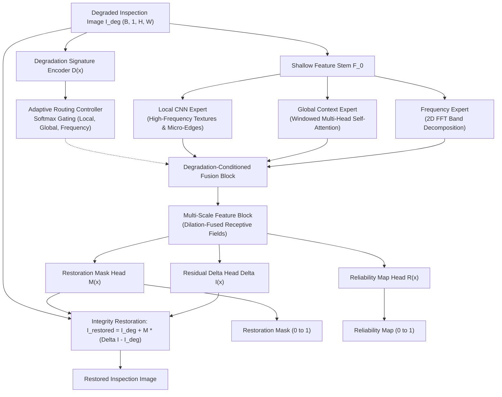

# AIRIS-Net

**Adaptive Industrial Restoration & Integrity-Safeguarding Network**

An AI-based restoration framework designed for degraded semiconductor and industrial inspection images, featuring degradation-aware adaptive multi-expert routing, integrity-preserving residual correction, and structural reliability estimation.

---

## Overview

High-precision industrial imaging—such as semiconductor wafer defect inspection, scanning electron microscopy (SEM), automated optical inspection (AOI), and printed circuit board (PCB) quality assurance—frequently suffers from compound physical degradations. Traditional denoising or super-resolution models often blur delicate edge boundaries or hallucinate non-existent features, risking false positives or missed critical micro-defects.

**AIRIS-Net** (Adaptive Industrial Restoration & Integrity-Safeguarding Network) addresses these challenges through:
1. **Degradation-Aware Adaptive Routing**: Dynamically analyzing image degradation signatures to modulate weights between specialized Local, Global, and Frequency experts.
2. **Integrity-Preserving Restoration**: Employing a learned restoration mask $M(x)$ and bounded residual delta $\Delta I$ to restrict modifications to corrupted areas while strictly safeguarding clean wafer structures.
3. **Reliability Map Estimation**: Generating a spatial reliability map $R(x) \in [0, 1]$ to signal confidence and identify regions requiring secondary manual verification.

---

## Problem & Degradation Types

Semiconductor manufacturing inspection environments experience various complex degradation phenomena:

- **Sensor Noise**: High-frequency Gaussian and Poisson shot noise from low-dose electron beam scanning.
- **Defocus & Motion Blur**: Sub-micron stage vibration and optical defocus during high-throughput scanning.
- **Low Contrast & Dynamic Range Compression**: Underexposure in deep trench structures or high-aspect-ratio wafer contacts.
- **Uneven Illumination**: Low-frequency non-uniform lighting fields and shadowing across wafer dies.
- **Compression Artifacts**: Quantization and blocking artifacts from high-speed image streaming.
- **Compound / Mixed Degradations**: Simultaneous combinations of noise, blur, and contrast loss.

---

## Architecture

AIRIS-Net integrates three specialized expert pathways with adaptive gating and integrity control:



### Architectural Highlights
- **Shallow Feature Extraction ($F_0$)**: Initial $3 \times 3$ convolutional stem extracting base spatial representations.
- **Degradation Signature Encoder ($D$)**: Strided convolutional encoder producing a compact latent embedding $\mathbf{d} \in \mathbb{R}^{64}$ and diagnostic scores.
- **Adaptive Router**: Softmax gating generating expert weights $(\alpha_{\text{local}}, \alpha_{\text{global}}, \alpha_{\text{freq}})$ satisfying $\sum \alpha = 1.0$.
- **Tri-Expert Processing**:
  - *Local CNN Expert*: Depthwise separable residual convolutions capturing fine micro-edges.
  - *Global Context Expert*: Window-based self-attention capturing periodic wafer die layout geometry.
  - *Frequency Expert*: 2D FFT spectral decomposition filtering periodic noise and high/low frequencies.
- **Integrity-Preserving Restoration**: Computes $I_{\text{restored}} = (1 - M) \odot I_{\text{degraded}} + M \odot \Delta I$, ensuring unmodified pixels retain original fidelity.
- **Reliability Map Head ($R$)**: Spatially resolved confidence map indicating restoration certainty.

---

## Key Features

- **Degradation-Aware Processing**: Automatically estimates degradation characteristics and routes features accordingly.
- **Adaptive Multi-Expert Fusion**: Balances spatial textures, long-range structural geometry, and spectral bands.
- **Integrity Safeguard**: Prevents destructive over-smoothing and feature erasure on critical semiconductor patterns.
- **Confidence & Reliability Maps**: Exposes spatial reliability for automated flag-and-escalate workflows.
- **Metric Verification**: Automated evaluation for PSNR, SSIM, Sobel edge consistency, and FFT spectral consistency.
- **Interactive Streamlit Demo**: Full web dashboard with live synthetic degradation simulator and diagnostic tabs.
- **CPU & GPU Compatible**: Operates on CPU systems without requiring dedicated CUDA GPUs.

---

## Repository Structure

```
AIRIS-Net/
│
├── airis/                         # Core AIRIS-Net Neural Network Modules
│   ├── __init__.py                # Package exports
│   ├── model.py                   # Complete AIRISNet architecture
│   ├── losses.py                  # Compound multi-task loss function
│   ├── shallow_features.py        # Stem feature extractor
│   ├── degradation_encoder.py     # Latent degradation signature encoder
│   ├── adaptive_router.py         # Softmax adaptive gating controller
│   ├── local_expert.py            # Local CNN residual expert
│   ├── global_expert.py           # Windowed attention global context expert
│   ├── frequency_expert.py        # 2D FFT frequency decomposition expert
│   ├── fusion.py                  # Degradation-conditioned expert fusion
│   ├── multiscale.py              # Multi-scale dilated feature block
│   ├── integrity_module.py        # Integrity-preserving restoration module
│   └── reliability.py             # Spatial reliability map estimation head
│
├── data/                          # Data Loading & Synthetic Degradation Pipeline
│   ├── __init__.py                # Data package exports
│   ├── dataset.py                 # Industrial paired dataset with dynamic cropping
│   ├── degradation.py             # Synthetic noise/blur/illumination pipeline
│   ├── train/clean/               # Clean training images (.gitkeep)
│   ├── val/clean/                 # Clean validation images (.gitkeep)
│   └── test/clean/                # Clean test images (.gitkeep)
│
├── utils/                         # Utilities & Evaluation Metrics
│   ├── __init__.py                # Utils package exports
│   ├── metrics.py                 # PSNR & SSIM mathematical calculations
│   ├── edge_utils.py              # Sobel edge extraction & consistency score
│   ├── frequency_utils.py         # 2D FFT log spectrum & frequency score
│   ├── image_utils.py             # Array conversion, I/O & change map calculation
│   └── checkpoint.py              # Model checkpoint save/resume helpers
│
├── configs/
│   └── train.yaml                 # Centralized training & model configuration
│
├── checkpoints/                   # Checkpoint storage directory (.gitkeep)
├── outputs/                       # Inference & test outputs directory (.gitkeep)
├── results/                       # Evaluation reports & logs (.gitkeep)
├── images/                        # Documentation assets & visual diagrams (.gitkeep)
│
├── train.py                       # Training script with validation & checkpointing
├── inference.py                   # Single-image inference CLI
├── evaluate.py                    # Dataset folder & single-triplet PSNR/SSIM evaluation
├── sanity_test.py                 # Shape, range & routing constraint verification
├── app.py                         # Streamlit interactive application
├── requirements.txt               # Project dependencies
├── LICENSE                        # MIT License
└── README.md                      # Project documentation
```

---

## Installation

### 1. Clone the Repository
```bash
git clone https://github.com/<your-username>/AIRIS-Net.git
cd AIRIS-Net
```

### 2. Create and Activate a Virtual Environment
```bash
# Windows
python -m venv venv
venv\Scripts\activate

# Linux / macOS
python3 -m venv venv
source venv/bin/activate
```

### 3. Install Dependencies
```bash
pip install -r requirements.txt
```

---

## Dataset Setup

AIRIS-Net expects clean grayscale ground-truth images in standard image formats (`.png`, `.jpg`, `.bmp`, `.tiff`) or NumPy arrays (`.npy`):

```
data/
├── train/clean/    # Clean images for training
├── val/clean/      # Clean images for validation
└── test/clean/     # Clean images for evaluation
```

> **Note**: For intellectual property and security reasons, proprietary semiconductor wafer datasets are not bundled in this public repository. Place your target inspection images in `data/train/clean/`, or use the built-in synthetic generation pipeline.

---

## Quick Start & Verification

### 1. Run Sanity Test
Verify model forward pass, output tensor dimensions, value bounds ($[0, 1]$), and routing sum constraints:
```bash
python sanity_test.py
```

### 2. Model Training
Run training using the configuration specified in `configs/train.yaml`:
```bash
# Fast verification training (2 epochs)
python train.py --epochs 2 --batch-size 2

# Full training run
python train.py --epochs 50 --batch-size 8
```
Checkpoints are automatically saved to `checkpoints/best_airis.pth` and `checkpoints/airis_epoch_*.pth`.

### 3. Single-Image Inference
Restore a degraded inspection image and generate all analytical maps:
```bash
python inference.py --input data/test/clean/sample.npy --checkpoint checkpoints/best_airis.pth
```
Outputs generated in `outputs/`:
- `outputs/restored.png` (Restored image)
- `outputs/restoration_mask.png` (Restoration mask $M$)
- `outputs/reliability_map.png` (Spatial reliability map $R$)
- `outputs/routing_weights.txt` (Expert routing weights)

### 4. Quantitative Evaluation (PSNR / SSIM)
Evaluate a dataset folder or a single triplet:
```bash
# Evaluate a test folder
python evaluate.py --folder data/test/clean --model airis --checkpoint checkpoints/best_airis.pth

# Evaluate a specific single image triplet
python evaluate.py --clean outputs/test_clean.png --degraded outputs/test_degraded.png --restored outputs/test_restored.png
```

### 5. Interactive Streamlit Demo
Launch the interactive web application to experiment with live synthetic degradations, inspect expert routing, and view edge/frequency diagnostic maps:
```bash
streamlit run app.py
```

---

## Outputs & Diagnostic Maps

AIRIS-Net provides comprehensive interpretability maps:

| Output | Description |
| :--- | :--- |
| **Restored Image** | Primary output after degradation removal and integrity safeguarding. |
| **Restoration Mask ($M$)** | Learned spatial gating map in $[0, 1]$ indicating where corrections were applied. |
| **Reliability Map ($R$)** | Spatial confidence estimate identifying regions of high certainty vs. potential ambiguity. |
| **Routing Weights** | Relative percentage allocated to Local ($w_{\text{local}}$), Global ($w_{\text{global}}$), and Frequency ($w_{\text{freq}}$) experts. |
| **Edge Analysis** | Sobel gradient magnitude maps comparing preserved structural boundaries. |
| **Restoration Change Map** | Normalized absolute difference $|\text{restored} - \text{degraded}|$ highlighting modified pixels. |
| **Frequency Spectrum** | 2D log FFT magnitude spectrum comparing frequency preservation. |

---

## Baseline Reference

For comparative benchmarking, **SwinIR** (Swin Transformer for Image Restoration) is supported via `baseline_swinir.py` and the Streamlit dashboard as an external reference.

> **Attribution**: SwinIR is developed by Liang et al. ([Official Repository](https://github.com/JingyunLiang/SwinIR)). SwinIR code and pretrained weights are the intellectual property of their respective authors and are not claimed as part of AIRIS-Net.

---

## Current Status & Verification

- **Software Implementation**: 100% complete and fully verified across all 25 unit/integration test suites (including forward, backward, optimizer updates, synthetic degradation, dataloading, checkpointing, inference, metrics, edge analysis, FFT verification, Streamlit UI, and CPU compatibility).
- **Architecture**: All 8 submodules (`ShallowFeatureStem`, `DegradationSignatureEncoder`, `AdaptiveRouter`, `LocalCNNExpert`, `GlobalContextExpert`, `FrequencyExpert`, `DegradationConditionedFusion`, `IntegrityPreservingRestoration`, `ReliabilityHead`) are operational.
- **Training**: Verified with fast CPU validation training (2 epochs). Production deployment requires training over 50+ epochs on GPU clusters.

---

## Known Limitations

1. **Synthetic Degradations**: The training pipeline applies randomized mathematical degradations (Gaussian noise, blur, illumination fields, contrast scaling, JPEG artifacts). While comprehensive, synthetic degradations may not capture all physical SEM beam-drift or charging artifacts.
2. **Reliability Map Calibration**: The reliability head produces relative confidence in $[0, 1]$ based on residual loss weighting. It represents structural certainty but is not formally calibrated Bayesian uncertainty.
3. **Defect Preservation Validation**: Restoration quality is verified mathematically via PSNR, SSIM, and edge consistency; downstream semiconductor defect classification and critical dimension (CD) metrology require domain-specific fab validation.

---

## Future Work

- [ ] **Fab Dataset Integration**: Benchmark on real-world industrial SEM wafer inspection datasets.
- [ ] **Defect Preservation Benchmark**: Quantify impact on downstream automated defect classification (ADC) accuracy and false alarm rates.
- [ ] **Learned Wavelet Frequency Decomposition**: Integrate learnable discrete wavelet transform (DWT) kernels.
- [ ] **Calibrated Uncertainty Estimation**: Incorporate conformal prediction or Bayesian Monte-Carlo dropout for rigorous risk bounds.
- [ ] **Edge Inference Optimization**: Export to ONNX Runtime and TensorRT for sub-50ms fab inline deployment.

---

## License

This project is licensed under the [MIT License](LICENSE).

---

## Disclaimer

AIRIS-Net is an engineering research prototype designed to demonstrate degradation-aware multi-expert restoration and integrity safeguarding for industrial inspection. Claims of restoration performance must be validated experimentally on specific target hardware and inspection datasets before production deployment.
